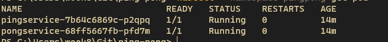

# Jugando con Docker Servicios Ping-Pong

Este ejercicio consta de 2 servicios desarrollados en golang, fueron desarrollados en unico archivo. La funcionalidad de los servicios es que **ping** llama al servicio **pong**, por medio del protocolo **http**. 

## Requerimeintos. 

Para efectos del ejercicio es necesario obtener nuestros fuentes, desde:  
- [Servicio ping](https://github.com/w00k/ping), servicio ping (descargarlo en tu **GOPATH**).
- [Servicio pong](https://github.com/w00k/pong), servicio pong (descargarlo en tu **GOPATH**).
- [Manual ping-pong](https://github.com/w00k/ping-pong), instrucciones (descargarlo en cualquier carpeta). 
- Docker instalado. 
- Usar el terminal o línea de comandos. 

# Generando las imágenes

Cada proyecto posee un **Dockerfile**, se ejecuta de la siguiente forma: 

## Imagen de servicio pong

En tu **GOPATH**, clona el respositorio del servicio pong.
```bash
git clone https://github.com/w00k/pong
```

Ingresa a la carpeta **pong**. 
```bash
cd pong
```

Genera el build de la imagen, con el nombre **pong**.
```bash
docker build -t pong .
```

## Imagen de servicio ping

En tu **GOPATH**, clona el respositorio del servicio ping.
```bash
git clone https://github.com/w00k/ping
```

Ingresa a la carpeta **ping**.
```bash
cd ping
```

Genera el build de la imagen, con el nombre **ping**.
```bash
docker build -t ping .
```

## Buscando las imágenes

Verificamos que esxisten las imagenes con los nombres **ping** y **pong**. 
```bash
docker image ls
```


# Usando docker-compose

Una vez que las imágenes están en nuestro docker local, podemos usar docker-compose para que nos genere una red y conecte los contenedores. 

Clonamos el repositorio de ping-pong, en cuaquier carpeta
```bash
git clone https://github.com/w00k/ping-pong
```

Ingresa a la carpeta **ping-pong**.
```bash
cd ping-pong/docker-compose
```

Si vemos el **docker-compose.yml**, veremos que 
* Utiliza las imagenes antes creadas (imagen **ping** y **pong**).
* El tag port expone exclusivamente el puerto **8080** tanto hacia el contenedor y hacia la máquina local. 
* El tag enviroment, está creando una variable local para indicarle al **servicio ping** el endpoint del **servicio pong**
* Existe una dependencia de la **imagen pong**. 

```yml
version: "3.8"

services:
  app:
    image: ping:v1
    environment:
       URL_PONG: "http://pong:8081/pong"
    depends_on:
      - pong
    ports:
      - "8080:8080"

  pong:
     image: pong:v1
```

Levantamos los contenedores por medio de docker-compose. 
```bash
docker-compose up -d 
```

Ejecutamos una prueba hacia el [http://localhost:8080/ping](http://localhost:8080/ping)  por medio de tu navegador favorito, postman, soap-ui ó la herramienta que uses. 


Para bajar el docker-compose, solo se debe ejecutar el sigueinte comando en dentro de la carpeta **docker-compose**.

```bash
docker-compose down 
```

## Usando K8S

Para usar **k8s**, se puede armar el ambiente usando los templates en archivos **yaml**. En arvhivos encontrarás una sección asociado para el **deploy** y otro apartado para el **service**, adicionalmente el servicio pong está expuesto en el puerto 30001 y el servicio pong en el 30000, es decir se pueden consumir desde  forma local. 

Para usar el apartado con **k8s**, es necesario crear un **namespace**, lo hice de esta forma porque es una buena practica. 

```bash
kubectl create namespace pingpong
```

Ahora podemos ingresar a la carpeta **k8s**. 

```bash
cd k8s
```

Y finalmente desplegamos, primero pong.

```bash
kubectl apply -f pong.yaml
```

Desplegamos ping. 

```bash
kubectl apply -f ping.yaml
```

Ahora podemos ver el estado de los pods. 

```bash
kubectl --namespace=pingpong get pod
```

Debe aparecer algo similar a esta imagen.



Para probar, para probar el servicio **ping** hay que ingresar a [http://localhost:30000/ping](http://localhost:30000/ping), la respuesta debería ser la siguiente.

```json
{"respond":"pong","send":"ping"}
```

Para probar el servicio **pong**, hay que ingresar a [http://localhost:30001/pong](http://localhost:30001/pong), la respuesta debe ser la siguiente. 

```json
{"message":"pong"}
```

Para desinstalar los **services** y el **deployments**, hay que ejecutar el comando **delete** por cada archivo **yaml** instalado.

Desinstalando **deployment ping**. 
```bash
kubectl delete -f ping.yaml
```

Desinstalando **deployment pong**. 
```bash
kubectl delete -f pong
```

Eliminando el **namespace pingpong**.
```bash
kubectl delete namespace pingpong
```